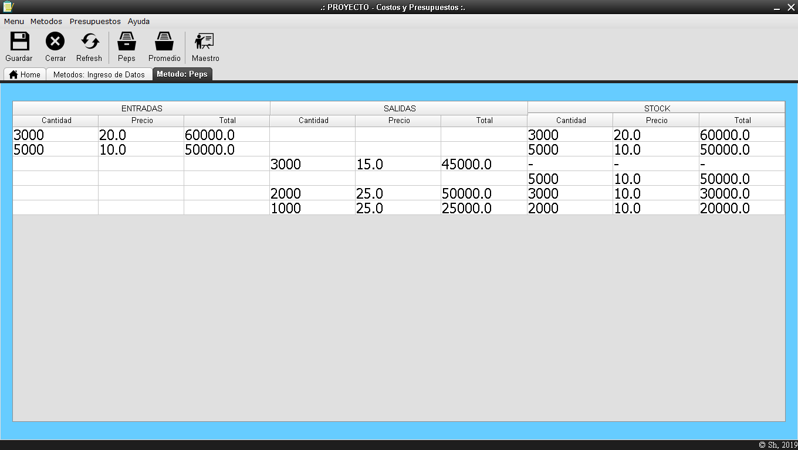

# Sistema de Métodos de Inventario - Java GUI
Sistema de Métodos de Inventario: PEPS y Promedio en lenguaje Java, y el Presupuesto Maestro; Proyecto del **quinto semestre** de estudios de Ingeniería Informática, presentado el **17/12/19**.

## Descripción

<strong>Imagen:</strong> GUI principal.

## Uso
1. [**Métodos**](#métodos)
     - [**Ingreso de datos (métodos)**](#ingreso-de-datos-métodos)
     - [**Método PEPS**](#método-peps)
     - [**Método Promedio**](#método-promedio)
     - [**Guardar método PEPS y Promedio**](#guardar-método-peps-y-promedio)
2. [**Presupuestos**](#presupuestos)
    - [**Ingreso de datos (presupuestos)**](#ingreso-de-datos-presupuestos)
    - [**Maestro**](#maestro)
    - [**Guardar Presupuesto Maestro**](#guardar-presupuesto-maestro)
3. [**Ayuda**](#ayuda)
    - [**Contacto**](#contacto)
    - [**Acerca de**](#acerca-de)

## Métodos

<strong>Imagen:</strong> Menú de metodos.

### Ingreso de datos (métodos)
Para los métodos primero debemos registrar las entradas y salidas, con un nombre o detalle según sea el producto además de la cantidad de este y el precio unitario. Si se ingresó un dato incorrecto se puede seleccionar y eliminar.

<strong>Imagen:</strong> Ingreso de Datos.

### Método PEPS
Ejemplo:
  a) Se compran 3000 carpetas c/u a 20 soles
  b) Se venden 3000 carpetas c/u a 15 soles
  c) Se venden 2000 carpetas c/u a 25 soles
  d) Se venden 1000 carpetas c/u a 25 soles
  e) Se compran 5000 carpetas c/u a 10 soles

<strong>Imagen:</strong> Método PEPS.

### Método Promedio
Ejemplo: *Tomamos el ejemplo anterior

<strong>Imagen:</strong> Método Promedio.

### Guardar métodos PEPS y Promedio
Lo hacemos desde la barra de herramientas en la opción de 'Guardar', nos pedirá ingresar un nombre y la ruta donde lo guardara.

<strong>Imagen:</strong> Guardar métodos.

<strong>Imagen:</strong> Archivo guardado de métodos.

## Presupuestos

<strong>Imagen:</strong> Menú de presupuestos.

### Ingreso de datos (presupuestos)
Para el presupuesto primero debemos registrar el año en el que inicia este presupuesto, el porcentaje de crecimiento por año y la cantidad de años en los que se tendrá el presupuesto; luego se registran los productos con un nombre o detalle, la cantidad de este, su precio de venta y el costo de producción. Si se ingresó un dato incorrecto se puede seleccionar y eliminar.

<strong>Imagen:</strong> Ingreso de Datos.

### Presupuesto Maestro
Ejemplo: Presupuesto para el año 2019 con una proyeccion de 5 años y un crecimiento por año del 10%, para los siguientes productos:
 a) 5000 del producto 'a' c/u se vende a 20 soles y cuesta 10 soles producirlo
 b) 3000 del producto 'b' c/u se vende a 15 soles y cuesta 25 soles producirlo
 c) 3000 del producto 'c' c/u se vende a 22 soles y cuesta 10 soles producirlo

<strong>Imagen:</strong> Ingreso de Datos.

### Guardar Presupuesto Maestro
Lo hacemos desde la barra de herramientas en la opción de 'Guardar', nos pedirá ingresar un nombre y la ruta donde lo guardara.

<strong>Imagen:</strong> Guardar presupuestos.

<strong>Imagen:</strong> Archivo guardado de presupuestos.

## Ayuda

<strong>Imagen:</strong> Menú de ayuda.

### Contacto

<strong>Imagen:</strong> Contactar al Soporte.

### Acerca de

<strong>Imagen:</strong> Acerca de Inventario.

